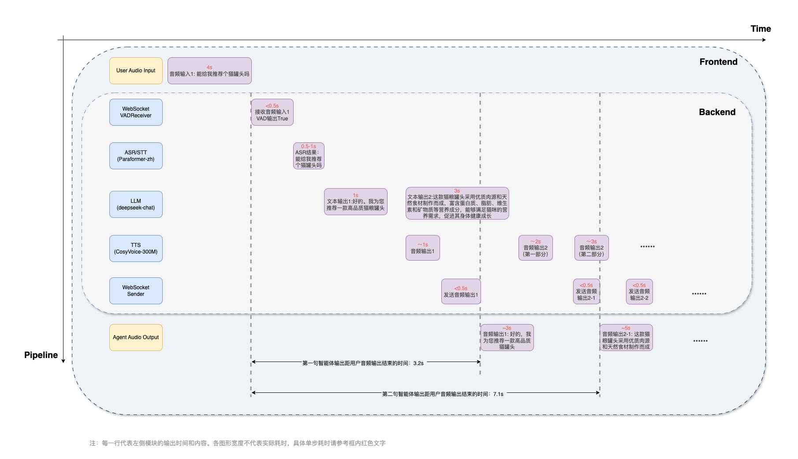

# CleanS2S

简体中文(Simplified Chinese)

**CleanS2S** 是一个语音到语音 (**S2S**) 的原型智能体，提供高质量的流式交互，并采用单文件实现。其设计简洁明了，旨在提供类似 GPT-4o 风格的中文交互原型智能体。该项目希望让用户直接体验语言用户界面 (**LUI**) 的强大功能，并帮助研究人员快速探索和验证 S2S pipeline 的潜力。


</details>


## 大纲

- [大纲](#大纲)
- [功能](#功能)
- [快速上手](#快速上手)
  - [后端（服务器）](#后端)
  - [前端（客户端）](#前端)
- [Roadmap](#Roadmap)
- [支持与参与](#支持与参与)
- [致谢](#致谢)
- [引用 CleanS2S](#引用-CleanS2S)
- [License](#License)


## 功能

### 📜 单文件实现

每个智能体管道的细节都放在一个独立的文件中。无需额外配置依赖项或理解项目文件结构。这对于那些想快速了解 S2S 管道并直接验证新想法的人来说，是一个很好的参考实现。所有管道实现都易于修改和扩展，用户可以快速更换喜欢的模型（例如 LLM）、添加新组件或自定义管道。

### 🎮 实时流式接口



整个 S2S 管道主要由 `ASR`（自动语音识别）、`LLM`（大型语言模型）和 `TTS`（文本转语音）组成，配合两个 `WebSockets` 组件接收器（包含 VAD）和发送器。管道设计为实时流模式，用户可以像人与人对话一样实时与智能体互动。所有音频和文本信息通过 WebSocket 流式发送和接收。为此，我们利用多线程和队列机制确保流过程顺畅，避免阻塞问题。所有组件都设计为异步和非阻塞，处理输入队列的数据并将结果输出到另一个队列。

### 🧫 全双工交互与打断机制

基于 [WebSockets](https://websockets.readthedocs.io/en/stable/) 提供的强大机制，管道支持全双工交互，这意味着用户可以同时与智能体对话和听取回复。此外，管道支持中断，用户可以在对话中随时通过新语音输入打断智能体。智能体将停止当前处理，开始处理新输入，并结合之前的对话和中断内容进行处理。此外，我们发现聊天机器人常用的“助理风格”和“轮流式”回应是人类对话的主要缺点之一。我们为智能体添加了更有趣的策略，以使对话更具互动性和吸引力。

### 🌍 网络搜索和 RAG

通过集成网络搜索功能和检索增强生成（RAG）模型，管道得到了进一步增强。这些功能使智能体不仅能实时处理和响应用户输入，还能从网络中获取和整合外部信息到响应中。这为回答用户提出的各种实际问题提供了扩展和灵活性。
  - WebSearchHelper 类负责根据用户查询进行在线搜索或收集与对话相关的附加信息。这使智能体能够参考最新或外部数据，增强响应的丰富性和准确性。
  - RAG 类实现了检索增强生成方法，首先从数据库中检索相关信息，然后使用这些信息生成响应。这一两步过程确保智能体的回复基于相关的事实数据，使互动更加知情和符合上下文。


## 快速上手

### 后端

#### 安装
```bash
## clone the repository
git clone 
cd CleanS2S/backend
pip install -r requirements.txt
```

- 根据[此处](https://github.com/modelscope/FunASR?tab=readme-ov-file#installation)的说明安装 `funasr (推荐1.1.6版本)` 以支持 paraformer-zh
- 根据[此处](https://github.com/FunAudioLLM/CosyVoice?tab=readme-ov-file#install)的说明安装 `cosyvoice` 以支持 CosyVoice-300M

#### 下载模型
您需要下载以下四个必要的模型（3个 ASR 模型 + 1个 TTS 模型），可以通过以下链接下载，并放置在合适的目录中。
- ASR: [paraformer-zh](https://huggingface.co/funasr/paraformer-zh), [ct-punc](https://huggingface.co/funasr/ct-punc), [fsmn-vad](https://huggingface.co/funasr/fsmn-vad)
- TTS: [CosyVoice-300M](https://github.com/FunAudioLLM/CosyVoice?tab=readme-ov-file#install)

对于 LLM，我们默认使用 LLM API，您也可以按照下方的说明定制自己的本地 LLM（如 DeepSeek-V2.5、Qwen2.5 等）。

> 删除 `--enable_llm_api` 和 `--lm_model_url` 参数，修改 `--lm_model_name` 参数为您的本地 LLM 模型路径（例如 `--lm_model_name /home/users/deepseek-v2.5`）。

您还需要准备一个参考音频目录，其中包含用于韵律和音色转换的参考音频。

如果您想使用自己的参考音频，需要保持与示例参考音频目录相同的格式。音频应为 10~20 秒长，发音清晰。


#### 运行服务器

以下是使用默认设置运行服务器的示例：
```bash
export LLM_API_KEY=<your-deepseek-api-key>
python3 -u s2s_server_pipeline.py \
        --recv_host 0.0.0.0 \
        --send_host 0.0.0.0 \
        --stt_model_name <your-asr-path> \
        --enable_llm_api \
        --lm_model_name "deepseek-chat" \
        --lm_model_url "https://api.deepseek.com" \
        --tts_model_name <your-tts-path> \
        --ref_dir <ref-audio-path> \
        --enable_interruption
```
> ℹ️ **支持自定义LLM**：在这里，我们使用 deepseek-chat 作为默认 LLM API ，您也可以根据 OpenAI 接口更改为其他 LLM API。（修改`--lm_model_name`和`--lm_model_url`，设置您自己的 API 密钥）

> ℹ️ **支持其他自定义**：您可以参考后端管道文件（例如`s2s_server_pipeline.py`）中由`argparse`库实现的参数列表，根据自己的需求进行自定义。所有参数在其帮助属性中都有详细文档，易于理解。

<br>
<details>
<summary><strong style="font-size: 1.5em;">使用 Websearch+RAG 运行服务器</strong></summary>
<br>

您首先需要安装 Websearch 和 RAG 所需的依赖。

```bash
pip install -r backend/requirements-rag.txt
```

其次，为 RAG 中嵌入 Websearch 结果选择一个嵌入模型，例如以下嵌入模型：

```bash
git lfs install
git clone https://huggingface.co/sentence-transformers/all-MiniLM-L6-v2
```

然后，为 Websearch 和 RAG 模块提供令牌，在`s2s_server_pipeline_rag.py`中，我们使用[Serper](https://serper.dev)作为 Websearch 工具，使用[Deepseek](https://deepseek.com)进行 RAG 。

```bash
export LLM_API_KEY=''
export SERPER_API_KEY=''
```

最后，在运行服务器的示例代码中，将`s2s_server_pipeline.py`替换为`s2s_server_pipeline_rag.py`，并添加参数`--embedding_model_name`。

这是使用默认设置和 Websearch+RAG 运行服务器的示例：

```bash
python3 -u s2s_server_pipeline_rag.py \
        --recv_host 0.0.0.0 \
        --send_host 0.0.0.0 \
        --stt_model_name <your-asr-path> \
        --enable_llm_api \
        --lm_model_name "deepseek-chat" \
        --lm_model_url "https://api.deepseek.com" \
        --tts_model_name <your-tts-path> \
        --embedding_model_name <embedding-model-path> \
        --ref_dir <ref-audio-path> \
        --enable_interruption
```
</details>


### 前端

我们建议使用`Docker镜像`来安装和运行客户端。以下是具体步骤：

```bash
## 运行基本的Docker镜像
docker run -it -p 3001:3001 amazonlinux:2023.2.20231011.0 sh
```

```bash
## 安装必要的包
dnf install vim git nodejs -y
npm install -g pnpm
git clone 
cd CleanS2S/frontend_nextjs
pnpm install
```

在`frontend_nextjs`目录中准备适当的`.env.local`文件，您可以参考`.env.example`文件以获取所需的环境变量。

```bash
## 运行客户端
pnpm dev --port 3001
```

然后您可以在浏览器中访问客户端，地址为`http://localhost:3001`（推荐使用 Chrome 浏览器）。

附注：如果您想在本地运行客户端，请首先安装 node.js 和 pnpm ，然后使用 pnpm 安装必要的包并运行客户端。

## Roadmap
- [x] 换声 (Voice Conversion) pipeline 支持（ASR + TTS）(即backend/vc_server_pipeline.py)
- [x] WebUI 优化（支持更多样的交互和功能）
- [ ] 推理速度优化
- [x] 后端多用户支持
- [x] 对话中的长期记忆和主动意图机制
- [x] 表情包等非文本交互机制
- [x] 更多提示词和 RAG 策略 (serper + jina + LightRAG)
- [ ] 真实场景下的实用的声纹检测机制
- [ ] 更多示例和评估工具
- [ ] 自定义示例角色
- [ ] 更有趣的互动和挑战机制
- [ ] 端到端 S2S 模型计划

## 支持与参与

我们非常感谢所有反馈和贡献，欢迎随时提问。也欢迎在 Github 上提交问题和 PR 。


## 致谢
- 感谢 [speech-to-speech](https://github.com/huggingface/speech-to-speech) 首次开源英文版的语音到语音交互 pipeline。
- 感谢 [funasr](https://github.com/modelscope/FunASR) 和 [CosyVoice](https://github.com/FunAudioLLM/CosyVoice) 开源高质量的中文ASR/TTS模型。
- 感谢 [HumeAI](https://github.com/HumeAI) 开源一系列前端组件。

## 引用 CleanS2S
```latex
@misc{CleanS2S,
    title={CleanS2S: Single-file Framework for Proactive Speech-to-Speech Interaction},
    publisher={GitHub},
    year={2024},
}
```

## License

CleanS2S 根据 Apache 2.0 许可证发布。
